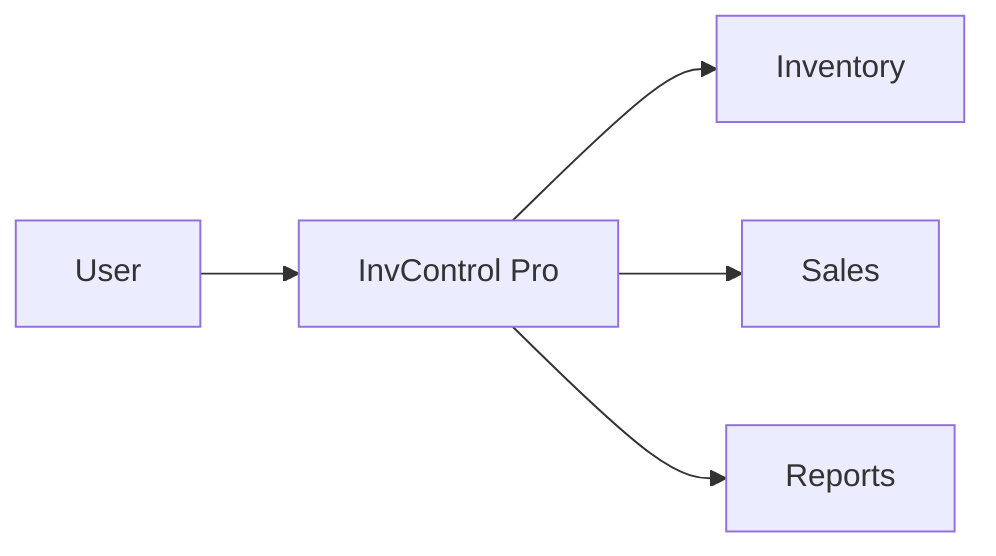

---


```markdown
# System Brief – InvControl Pro

## Problema

Los negocios pequeños suelen manejar inventarios y ventas de forma manual o con herramientas no integradas, lo que provoca errores en el control de stock y poca visibilidad financiera.

## Stakeholders

- Dueño del negocio
- Empleados
- Contador

## Scope

- Registro de productos
- Registro de ventas
- Control de inventario
- Registro manual de facturas
- Visualización de ganancias/pérdidas

## No-Scope

- Facturación electrónica
- Integración bancaria
- Aplicación móvil
- E-commerce

## Diagrama de contexto


